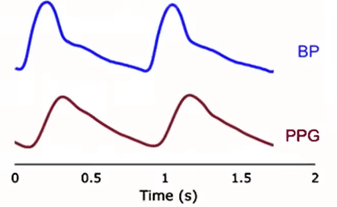

# Blood-Pressure-Estimation
Blood Pressure Estimation from PPG Signals Using Machine Learning

## Introduction

In today's healthcare landscape, the continuous and non-invasive monitoring of blood pressure is of paramount importance, given its role as a critical indicator of cardiovascular health. This repository explores the intersection of photoplethysmography (PPG) signals and blood pressure estimation.
By delving into the intricacies of PPG signals, signal processing techniques, and machine learning algorithms, we aim to bridge the gap between these signals and accurate blood pressure measurements, ultimately contributing to a future where unobtrusive and continuous blood pressure monitoring enhances patient comfort and healthcare outcomes.
There is relationship between PPG signals and blood pressure, in below this relationship is showed:

  

