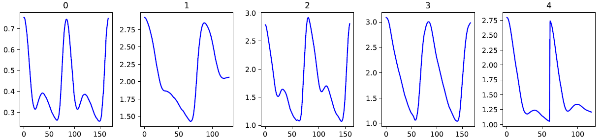

# Blood-Pressure-Estimation
Blood Pressure Estimation from PPG Signals Using Machine Learning

## Introduction

In today's healthcare landscape, the continuous and non-invasive monitoring of blood pressure is of paramount importance, given its role as a critical indicator of cardiovascular health. This repository explores the intersection of photoplethysmography (PPG) signals and blood pressure estimation.
By delving into the intricacies of PPG signals, signal processing techniques, and machine learning algorithms, we aim to bridge the gap between these signals and accurate blood pressure measurements, ultimately contributing to a future where unobtrusive and continuous blood pressure monitoring enhances patient comfort and healthcare outcomes.
There is a relationship between PPG signals and blood pressure, and below, this relationship is demonstrated:

  

# Dataset: 

The dataset can be found in the **./datasets**.

# Phase 1

The goal in Phase 1 is to estimate blood pressure from segmented PPG signals. In below segmented PPG signals is shown:

  

## The following steps are executed in the **blood_pressure_estimation_phase1.ipynb**:

1- Preprocessing: Normalization - Elimination of short signals

2- Base line model: Use average for base line model

3- Upsampling: Set length of signals to 200ms

4- Defining and training a linear regression model, followed by making predictions on a test dataset

5- We define and train a ridge regression model, and then proceed to utilize it for making predictions on a test dataset.

6- Defining and training a lasso model, followed by using it to make predictions on a test dataset.

# Phase 2

In phase2, we are going to get a little closer to the real issue. 
